# Epic Architecture Specification: Anonymous Access Hardening & Consent Lifecycle

> **Stack note:** This spec targets the stack actually used in this repository — a **.NET minimal API** backend, **PostgreSQL** (via EF Core), a **React/Vite** operator frontend, and **Docker Compose** for local/self-hosted deployment (see [Program.cs](../../../../../src/Stub.Api/Program.cs), [docker-compose.yml](../../../../../docker-compose.yml)). It does not use Next.js/tRPC/Turborepo/Stack Auth/n8n/Qdrant, since those are not part of this codebase; equivalent responsibilities are mapped onto the existing stack below. This epic extends the Phase 1 architecture (see the [Digital Receipt Platform MVP arch spec](../digital-receipt-platform-mvp/arch.md)) and assumes the Phase 1 `Stub.Api`, `Stub.Frontend`, and PostgreSQL schema already exist.

## 1. Epic Architecture Overview

This epic adds three new internal domain areas to the existing `Stub.Api` modular monolith, without splitting the deployable: a **Challenge/Step-Up Verification** domain that gates full anonymous history access behind a possession proof, a **Consent Management** domain that tracks grant/revoke lifecycle for customer contact channels per merchant and purpose, and two new **Envelope Module Handlers** (warranty, loyalty) that write/read versioned JSON modules into the receipt envelope column established in Phase 1. All three areas persist to the same PostgreSQL instance via new EF Core entities/tables, and are exposed through new minimal API endpoint groups alongside the existing merchant/receipt endpoints. The React/Vite frontend gains operator-facing screens to simulate the challenge flow, manage consent records, and configure warranty/loyalty modules on a receipt — consistent with its existing role as a test/operator surface rather than a customer-facing production UI. No new required infrastructure is introduced; a pluggable notification interface stands in for SMS/email delivery so the challenge flow can be tested without a hard dependency on a third-party provider.

## 2. System Architecture Diagram

```mermaid
flowchart TB
    subgraph UserLayer["User Layer"]
        direction LR
        Customer["Customer<br/>(history request, consent actions)"]
        MerchantAdmin["Merchant Admin<br/>(warranty/loyalty config, consent view)"]
    end

    subgraph AppLayer["Application Layer"]
        direction LR
        LB["Reverse Proxy / Load Balancer"]
        SPA["Stub.Frontend<br/>React + Vite SPA<br/>(operator/test surface)"]
    end

    subgraph ServiceLayer["Service Layer — Stub.Api (ASP.NET Core Minimal API)"]
        direction TB
        HistorySvc["Anonymous History Access Service<br/>(Phase 1, extended)"]
        ChallengeSvc["Challenge / Step-Up Verification Service<br/>issue + verify possession proof"]
        ConsentSvc["Consent Management Service<br/>grant / list / revoke contact consent"]
        WarrantyHandler["Warranty Envelope Module Handler<br/>attach/read warranty terms"]
        LoyaltyHandler["Loyalty Envelope Module Handler<br/>attach/read loyalty participation"]
        NotifyIface["Notification Interface (pluggable)<br/>one-time code delivery abstraction"]
    end

    subgraph DataLayer["Data Layer"]
        direction LR
        PG[("PostgreSQL<br/>+ challenge_attempts, consent_records<br/>+ receipt envelope: warranty/loyalty modules")]
        Cache[("In-memory / Redis cache (future)<br/>challenge + rate-limit counters")]
        NotifyProvider["External Email/SMS Provider<br/>(future, behind NotifyIface)"]
    end

    subgraph InfraLayer["Infrastructure Layer — Docker Compose"]
        direction LR
        ApiContainer["api container<br/>Stub.Api.Dockerfile"]
        DbContainer["db container<br/>postgres:17-alpine"]
        FrontendContainer["frontend container<br/>Stub.Frontend.Dockerfile"]
    end

    Customer -->|"request full history"| SPA
    Customer -->|"grant / view / revoke consent"| SPA
    MerchantAdmin -->|"configure warranty/loyalty on receipt"| SPA
    SPA -->|HTTPS REST + CORS| LB
    LB --> HistorySvc
    LB --> ChallengeSvc
    LB --> ConsentSvc
    LB --> WarrantyHandler
    LB --> LoyaltyHandler

    HistorySvc -->|"baseline view (no challenge)"| PG
    HistorySvc -->|"full view requires"| ChallengeSvc
    ChallengeSvc -->|"verify possession proof"| PG
    ChallengeSvc -->|"issue one-time code"| NotifyIface
    ChallengeSvc -->|"rate-limit + attempt counters"| Cache
    NotifyIface -.->|future integration| NotifyProvider

    ConsentSvc -->|"grant/revoke records"| PG
    WarrantyHandler -->|"write/read envelope.warranty (JSONB)"| PG
    LoyaltyHandler -->|"write/read envelope.loyalty (JSONB)"| PG

    ApiContainer -.hosts.-> ServiceLayer
    DbContainer -.hosts.-> PG
    FrontendContainer -.hosts.-> SPA

    classDef user fill:#e0f2fe,stroke:#0369a1,color:#0c4a6e
    classDef app fill:#ede9fe,stroke:#6d28d9,color:#4c1d95
    classDef svc fill:#dcfce7,stroke:#15803d,color:#14532d
    classDef data fill:#fef3c7,stroke:#b45309,color:#78350f
    classDef infra fill:#f1f5f9,stroke:#475569,color:#1e293b

    class Customer,MerchantAdmin user
    class LB,SPA app
    class HistorySvc,ChallengeSvc,ConsentSvc,WarrantyHandler,LoyaltyHandler,NotifyIface svc
    class PG,Cache,NotifyProvider data
    class ApiContainer,DbContainer,FrontendContainer infra
```

**Synchronous paths:** SPA → API for consent grant/list/revoke, warranty/loyalty module attach/read, and challenge issuance/verification all return within the request/response cycle.
**Gated path:** Full history retrieval is synchronous but conditionally short-circuited — the History Service returns a challenge requirement instead of full data until the Challenge Service confirms a verified possession proof for that request context.

## 3. High-Level Features & Technical Enablers

### Features

- Tiered anonymous history response: baseline (unchallenged) vs. full (challenge-gated).
- Possession-based challenge issuance and verification (e.g., match a submitted value against a recent transaction attribute, or a short-lived one-time code).
- Challenge attempt audit logging (issued/succeeded/failed/expired) independent of the Phase 1 history audit log.
- Consent grant/list/revoke endpoints scoped to customer + merchant + purpose + contact channel.
- Consent enforcement gate: any contact-channel use must resolve against an active, non-revoked consent record for the matching purpose.
- Warranty envelope module: attach/read product reference, coverage window, and terms reference on a receipt.
- Loyalty envelope module: attach/read program reference and participation status on a receipt.
- Envelope module versioning so warranty/loyalty schema can evolve without breaking previously created receipts.

### Technical Enablers

- **Challenge attempt table** (`challenge_attempts`): stub identifier, challenge type, issued-at, expires-at, outcome, verified-at — with the actual challenge secret stored only as a salted hash, never plaintext.
- **Pluggable `INotificationSender` interface** in `Stub.Api` for one-time code delivery, with an in-memory/log-based implementation for local/dev and a seam for a real provider later — keeps this epic's Docker Compose footprint unchanged.
- **Consent record table** (`consent_records`): customer stub identifier reference, merchant id (FK), contact channel type, contact value, purpose, consent version, granted-at, revoked-at (nullable), with a unique constraint on `(customer_id, merchant_id, purpose, channel)` for the currently active grant.
- **Consent enforcement check** implemented as a shared guard invoked by any future contact-channel-consuming code path (e.g., a merchant "send receipt to email" action), returning a deterministic "no active consent" error rather than silently failing.
- **Envelope module writer/reader helpers** built on top of the Phase 1 JSONB envelope column, each module namespaced (`envelope.warranty`, `envelope.loyalty`) and carrying its own `moduleVersion` field.
- **Independent rate-limit/attempt counters** for the challenge flow (separate budget from the Phase 1 history rate limiter) using the same in-process-counter-now/Redis-later pattern already established.
- **EF Core migrations** for the new tables (`challenge_attempts`, `consent_records`) plus the envelope module shape, continuing the Phase 1 direction of moving off `EnsureCreated()`.
- **Structured audit logging** extended to cover challenge and consent events with consistent correlation fields (stub identifier, merchant id, event type, outcome).

## 4. Technology Stack

- **Backend**: .NET (ASP.NET Core Minimal APIs), C#
- **ORM/Data Access**: Entity Framework Core (Npgsql provider)
- **Database**: PostgreSQL 17 (new tables: `challenge_attempts`, `consent_records`; extended envelope JSONB modules on the existing receipt entity)
- **Frontend**: React + Vite (JavaScript/JSX) — operator/test surfaces for challenge simulation, consent management, and warranty/loyalty configuration
- **Containerization**: Docker, Docker Compose (no new required services)
- **Notification Abstraction**: Pluggable `INotificationSender` interface (log/in-memory implementation for MVP of this epic; real email/SMS provider is a future integration)
- **Testing**: xUnit-style test project (`Stub.Api.Tests`), extended with challenge/consent/envelope-module test coverage
- **Future/optional**: Redis (distributed rate limiting for challenge attempts), external email/SMS provider behind the notification interface

## 5. Technical Value

**High.** This epic converts two of the platform's named Phase 2 risks (weak anonymous access, unmanaged consent) into concrete, testable, auditable subsystems while strictly preserving the Phase 1 API surface and Docker Compose topology — no new required infrastructure, no core schema break. Activating the warranty and loyalty envelope modules directly validates the "envelope-first, no rework" bet made in the Phase 1 architecture, proving the extensibility pattern holds under a second and third real module rather than remaining theoretical.

## 6. T-Shirt Size Estimate

**L** — Introduces two new cross-cutting subsystems (challenge/step-up verification, consent lifecycle) plus two new envelope modules (warranty, loyalty) across backend and frontend, including new persisted tables, audit logging extensions, and a pluggable notification seam, while maintaining backward compatibility with all Phase 1 endpoints and data.
