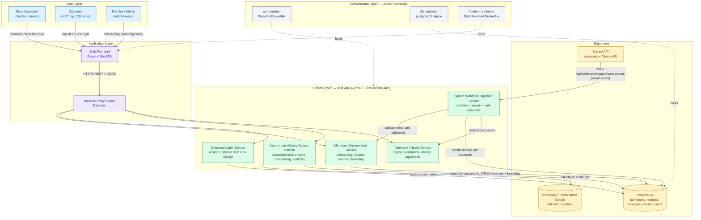

# Epic Architecture Specification: Digital Receipt Platform MVP

> **Stack note:** This spec targets the stack actually used in this repository — a **.NET minimal API** backend, **PostgreSQL** (via EF Core), a **React/Vite** operator frontend, and **Docker Compose** for local/self-hosted deployment (see [Program.cs](../../../../../src/Stub.Api/Program.cs), [docker-compose.yml](../../../../../docker-compose.yml)). It does not use Next.js/tRPC/Turborepo/Stack Auth/n8n/Qdrant, since those are not part of this codebase; equivalent responsibilities are mapped onto the existing stack below.

## 1. Epic Architecture Overview

The epic is delivered as a single ASP.NET Core minimal API service (`Stub.Api`) backed by PostgreSQL, fronted by a React/Vite operator SPA (`Stub.Frontend`), all containerized via Docker Compose. The domain is split into two bounded contexts inside the API: **Merchant Management** (onboarding, POS linkage, branding) and **Receipt Lifecycle** (ingestion, claimability, retrieval, envelope). Square delivers transaction events via webhook; the API validates, persists a core receipt plus an extensible JSON envelope, and flips receipt state to `claimable`. Customers claim a receipt at checkout using a stub identifier (NFC/QR-carried), and later retrieve history through a possession/risk-gated endpoint rather than the identifier alone. The architecture is intentionally modular-monolith for the MVP (single deployable API), with clear internal domain boundaries so ingestion, claim, and history-access concerns can be split into separate services in later phases without a data model rewrite.

## 2. System Architecture Diagram

**Synchronous paths:** SPA → API (merchant CRUD, claim assignment, receipt-by-id, customer history lookup) all return within the request/response cycle.
**Asynchronous path:** Square → webhook ingestion → persist → claimable-state transition happens off the customer's synchronous checkout wait, but must complete fast enough that the tap/scan (which polls/retries) sees the receipt as claimable within the checkout window.

## 3. High-Level Features & Technical Enablers

### Features

- Merchant onboarding and Square connection status management.
- Real-time Square transaction webhook ingestion with validation and idempotency.
- Receipt claimability state machine (pending → claimable → claimed).
- Checkout claim endpoint linking a customer stub identifier to a receipt.
- Receipt-by-id retrieval with deterministic not-found handling.
- Anonymous customer history retrieval gated by possession/risk checks (beyond the bare identifier).
- Merchant-level receipt branding/customization storage.
- Extensible receipt envelope (versioned JSON module container) alongside the core receipt.
- Health/telemetry endpoint exposing ingest-to-claimable latency.

### Technical Enablers

- **Idempotency key handling** on the webhook endpoint (Square transaction id) to prevent duplicate receipts on retry delivery.
- **Envelope column** (JSONB in PostgreSQL) on the receipt entity, versioned, separate from core compliance fields, to host optional loyalty/ads/warranty/integration modules without core schema changes.
- **Rate limiting / abuse-detection middleware** in front of the history-access endpoint (in-process counter for MVP; pluggable to Redis later).
- **Audit log table** capturing retrieval attempts (who/when/outcome) for the anonymous-access pathway.
- **Consent record table** (email/phone, purpose, version, timestamp, revoked-at) kept separate from the core receipt/customer link, populated only on explicit opt-in.
- **Structured logging + metrics** around webhook receipt time → claimable time, exposed via the health/telemetry endpoint for p50/p95/p99 tracking.
- **Docker Compose service definitions** for api/db/frontend already in place; extend with environment-based config for Square credentials/webhook secrets.
- **EF Core migrations** to replace `EnsureCreated()` with versioned migrations once schema stabilizes for the envelope/consent/audit tables.

## 4. Technology Stack

- **Backend**: .NET (ASP.NET Core Minimal APIs), C#
- **ORM/Data Access**: Entity Framework Core (Npgsql provider)
- **Database**: PostgreSQL 17
- **Frontend**: React + Vite (JavaScript/JSX)
- **Containerization**: Docker, Docker Compose
- **POS Integration**: Square Webhooks + Square Orders API
- **Testing**: xUnit-style test project (`Stub.Api.Tests`)
- **Future/optional**: Redis (distributed rate limiting/caching), a message queue (e.g., for decoupling webhook ingestion from downstream processing) if ingestion volume requires it

## 5. Technical Value

**High.** The envelope-first schema and explicit core/extension boundary directly avoid the platform's largest identified rework risk (Risk 4 in the PRD). Establishing possession/risk-gated history access and audit logging now avoids costly retrofits and reduces breach exposure. The modular-monolith service boundaries inside a single deployable also keep initial operational complexity low while preserving a clean seam for splitting ingestion/claim/history into independent services in later phases.

## 6. T-Shirt Size Estimate

**L** — Spans new domain logic (claimability state machine, envelope schema, consent model, risk-gated history access, audit logging, telemetry) across both backend and frontend, plus Docker/config changes, while keeping backward compatibility with the existing MVP endpoints already shipped.
