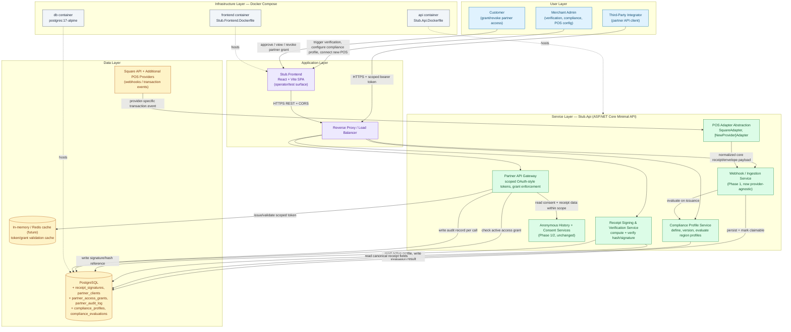

# Epic Architecture Specification: Trust, Compliance & Partner Ecosystem

> **Stack note:** This spec targets the stack actually used in this repository — a **.NET minimal API** backend, **PostgreSQL** (via EF Core), a **React/Vite** operator frontend, and **Docker Compose** for local/self-hosted deployment (see [Program.cs](../../../../../src/Stub.Api/Program.cs), [docker-compose.yml](../../../../../docker-compose.yml)). It does not use Next.js/tRPC/Turborepo/Stack Auth/n8n/Qdrant, since those are not part of this codebase; equivalent responsibilities are mapped onto the existing stack below. This epic extends both the Phase 1 architecture ([Digital Receipt Platform MVP arch spec](../digital-receipt-platform-mvp/arch.md)) and the Phase 2 architecture ([Anonymous Access Hardening & Consent Lifecycle arch spec](../anonymous-access-hardening-and-consent/arch.md)), and assumes the existing `Stub.Api`, `Stub.Frontend`, PostgreSQL schema, consent model, and envelope modules already exist.

## 1. Epic Architecture Overview

This epic adds four new internal domain areas to the existing `Stub.Api` modular monolith, continuing the pattern established in Phase 1/2 of adding bounded domains rather than splitting the deployable: a **Receipt Signing & Verification** domain that computes and checks cryptographic signatures over canonical receipt fields using the verification fields already reserved in the Phase 1 schema; a **Partner API Gateway** domain that issues scoped, time-bound OAuth-style client credentials and customer-authorized access grants for third-party integrators, building directly on the Phase 2 consent model; a **Compliance Profile** domain that defines, versions, and evaluates configurable regional compliance rule sets against receipts without touching the core schema; and a **POS Adapter** abstraction layer that normalizes provider-specific transaction payloads (Square today, additional providers going forward) into the same core receipt/envelope ingestion contract already in place. All four domains persist to the same PostgreSQL instance via new EF Core entities/tables and are exposed through new minimal API endpoint groups alongside existing merchant/receipt/consent endpoints. The React/Vite frontend gains operator-facing screens to trigger/inspect verification results, manage partner credentials and grants, view compliance evaluation status, and simulate ingestion from a non-Square adapter — consistent with its existing role as an operator/test surface. No new required infrastructure is introduced for the MVP of this epic; partner token issuance/validation is implemented in-process (JWT-style signed tokens) rather than via a dedicated identity provider, and POS adapters beyond Square are represented as an interface with at least one additional sample implementation.

## 2. System Architecture Diagram

**Synchronous paths:** SPA/operator actions (trigger verification, define/attach compliance profile, issue/revoke partner credential or grant) and Partner API calls (bearer-token-authenticated reads within granted scope) all return within the request/response cycle.
**Ingestion path (extended):** POS provider → provider-specific adapter → normalized core receipt/envelope payload → existing claimability pipeline → compliance evaluation recorded alongside issuance, all without the customer-facing claim/history experience changing.
**Partner path:** Partner client authenticates with a scoped token → Partner API Gateway checks the token's scope and the customer's active access grant → on success, the gateway reads only the in-scope data via existing history/consent services and writes an audit record; on failure (expired/revoked/out-of-scope), the call is rejected deterministically before any data is read.

## 3. High-Level Features & Technical Enablers

### Features

- Cryptographic signing of a receipt's canonical core fields, with a deterministic verification result (`valid` / `invalid` / `unverifiable`).
- Per-merchant/per-region phased activation of verification, with no re-issuance required for existing receipts.
- Partner client registration with scoped credentials (data type + merchant/customer coverage).
- Customer-facing partner access grant approval, viewing, and revocation, built on the Phase 2 consent model.
- Full audit trail for every partner API call (partner, scope, subject, outcome, timestamp).
- Regional compliance profile definition, versioning, and activation per merchant/region.
- Compliance evaluation recorded per receipt at issuance without blocking claimability.
- POS Adapter interface with the existing Square integration refactored to implement it, plus at least one additional adapter to prove the abstraction.
- Adapter-normalized ingestion reusing the existing claim/history/envelope/compliance pipeline unchanged.

### Technical Enablers

- **`receipt_signatures` table**: receipt id (FK), algorithm identifier, signature/hash value, canonicalization version, signed-at — populated using the verification fields already reserved in the Phase 1 core receipt schema, so no core schema redesign is required.
- **Canonicalization routine**: a deterministic serialization of the receipt's core fields (stable field order, normalized types) used as signing/verification input, versioned so future field additions don't invalidate prior signatures.
- **`partner_clients` table**: client id, name, allowed scopes, status (active/revoked), created-at — registered by an internal admin action (no public self-service in this epic).
- **`partner_access_grants` table**: customer stub identifier reference, partner client id (FK), merchant scope, data-type scope, granted-at, expires-at, revoked-at (nullable) — enforced on every partner API call.
- **Scoped bearer token issuance**: signed, short-lived tokens (JWT-style, signed in-process with a service-held key) encoding client id and granted scope; validated on each partner API call against both token signature/expiry and the corresponding active `partner_access_grants` row.
- **`partner_audit_log` table**: partner client id, grant id, endpoint, subject (customer/receipt), outcome, timestamp — append-only, queryable for audit and dispute resolution.
- **`compliance_profiles` table**: profile id, region/label, version, rule definition (structured data describing required fields/format/retention expectations), active flag.
- **`compliance_evaluations` table**: receipt id (FK), profile id (FK) + version, status (`compliant` / `missing-fields` / `not-evaluated`), evaluated-at — written at issuance by the ingestion pipeline without altering claimability.
- **`IPosAdapter` interface** in `Stub.Api`: normalizes a provider-specific payload into the existing core receipt/envelope ingestion contract; `SquareAdapter` becomes the reference implementation, with a second adapter added to validate the abstraction holds for a different payload shape.
- **Adapter registry/dispatch**: incoming webhook requests are routed to the correct `IPosAdapter` implementation based on merchant POS-provider configuration, reusing the same validation/idempotency/claimable-state-machine code already in place.
- **EF Core migrations** for all new tables (`receipt_signatures`, `partner_clients`, `partner_access_grants`, `partner_audit_log`, `compliance_profiles`, `compliance_evaluations`), continuing the move off `EnsureCreated()` started in earlier phases.
- **Structured audit logging** extended with partner-call and compliance-evaluation event types, using the same correlation-field conventions established in Phase 2.

## 4. Technology Stack

- **Backend**: .NET (ASP.NET Core Minimal APIs), C#
- **ORM/Data Access**: Entity Framework Core (Npgsql provider)
- **Database**: PostgreSQL 17 (new tables: `receipt_signatures`, `partner_clients`, `partner_access_grants`, `partner_audit_log`, `compliance_profiles`, `compliance_evaluations`)
- **Cryptography**: .NET built-in cryptography primitives (e.g., `System.Security.Cryptography` hashing/HMAC or asymmetric signing) — no new third-party crypto dependency required
- **Partner Authentication**: In-process signed, scoped, short-lived tokens (JWT-style) validated against `partner_access_grants`; no dedicated external identity provider introduced in this epic
- **Frontend**: React + Vite (JavaScript/JSX) — operator/test surfaces for verification, partner credential/grant management, compliance status, and adapter simulation
- **Containerization**: Docker, Docker Compose (no new required services for this epic's MVP)
- **POS Integration**: Square Webhooks + Square Orders API (existing), plus a `IPosAdapter`-conformant sample adapter for an additional provider
- **Testing**: xUnit-style test project (`Stub.Api.Tests`), extended with signature verification, partner-scope enforcement, compliance evaluation, and adapter-normalization test coverage

## 5. Technical Value

**High.** This epic directly redeems the "design for later" commitments made explicit in Phase 1 (reserved verification fields, envelope extensibility, region-profiled schema) by implementing them without a core schema redesign, proving that architectural discipline paid off. The `IPosAdapter` abstraction converts POS-provider expansion from a rearchitecture risk into an additive engineering task, and the Partner API Gateway's grant/audit model reuses the Phase 2 consent infrastructure rather than duplicating it, minimizing net-new security surface while unlocking a materially larger addressable market (new regions, new POS-provider merchants, new partner integrations).

## 6. T-Shirt Size Estimate

**XL** — Spans four substantial new domains (signing/verification, partner gateway with token issuance and grant enforcement, compliance profiles, POS adapter abstraction with a second provider) each with new persistence, new API surface, and new operator UI, while requiring strict backward compatibility with all Phase 1/Phase 2 endpoints and data.
